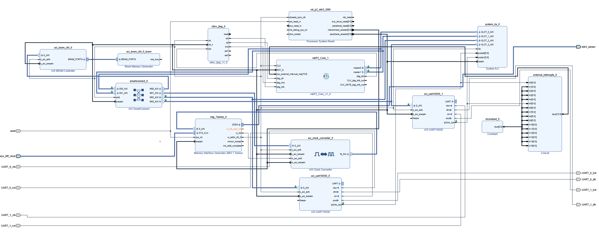
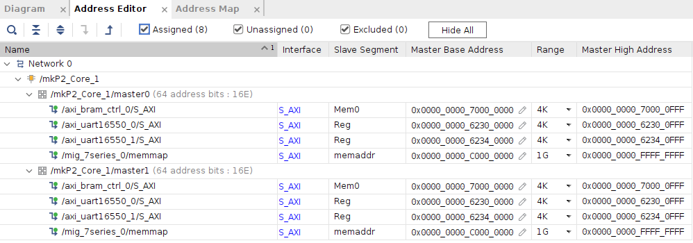
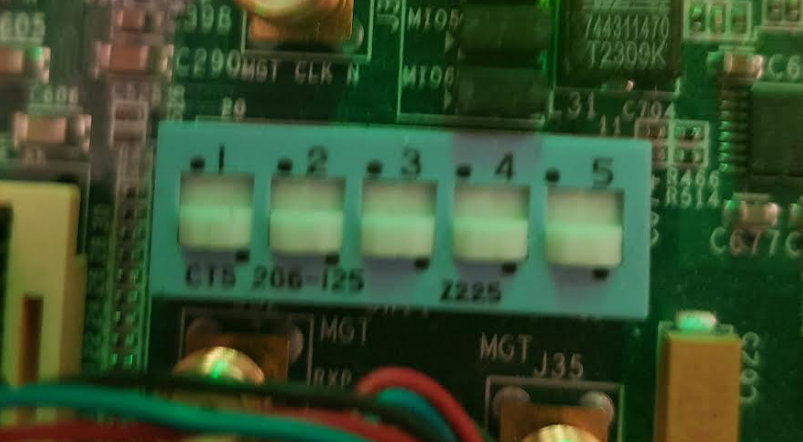
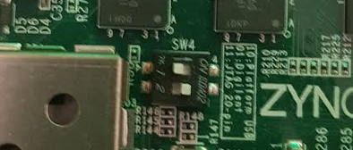
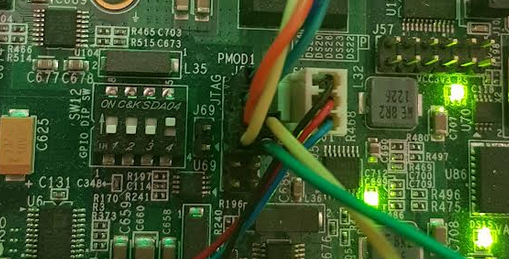
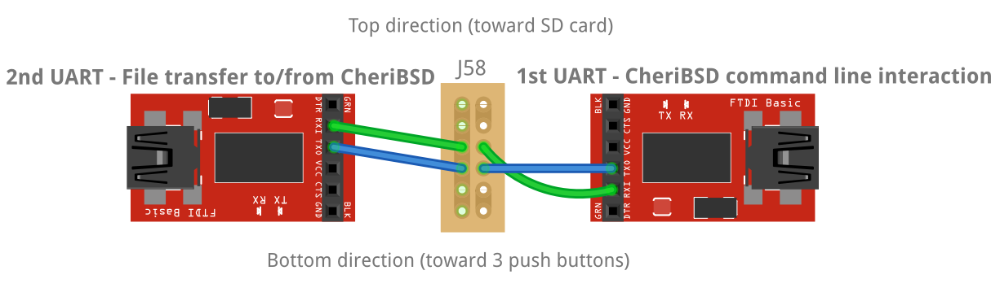
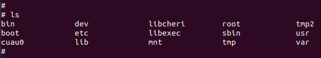

# CheriBSD-on-minimal-hardware
Files and instructions for running CheriBSD using Flute processor implemented on ZC706 board. 
- [Purpose](#purpose)
- [Background and characteristics of the minimal hardware design](#background-and-characteristics-of-the-minimal-hardware-design)
- [Block design](#block-design)
- [Prerequisites](#prerequisites)
- [Setup](#setup)
  - [1\. ZC706 switches setting.](#1-zc706-switches-setting)
  - [2\. Connect TTL-to-Converters to the J58 pins on ZC706 board.](#2-connect-ttl-to-converters-to-the-j58-pins-on-zc706-board)
  - [3\. Connect the TTL-to-USB converters to the host computer.](#3-connect-the-ttl-to-usb-converters-to-the-host-computer)
  - [4\. Clone this repository.](#4-clone-this-repository)
  - [5\. Program the ZC706 board.](#5-program-the-zc706-board)
  - [6\. Install and run OpenOCD (possibly requires GFE-specific version).](#6-install-and-run-openocd-possibly-requires-gfe-specific-version)
  - [7\. Run GDB in a separate terminal.](#7-run-gdb-in-a-separate-terminal)
  - [8\. Transfer files to/from CheriBSD through 2nd UART.](#8-transfer-files-tofrom-cheribsd-through-2nd-uart)
    - [Setting BAUD rate](#setting-baud-rate)
    - [Sending files to CheriBSD](#sending-files-to-cheribsd)
- [Recreating files used in this guide](#recreating-files-used-in-this-guide)
  - [bbl and kernels](#bbl-and-kernels)
  - [bit and ltx](#bit-and-ltx)
  - [bootrom.coe](#bootromcoe)
- [Additional notes](#additional-notes)


# Purpose
It is relatively straightforward to run CheriBSD on an open-source processor (e.g. Flute, Toooba) when in possession of VCU118 board (as explained on [cheripedia](https://github.com/CTSRD-CHERI/cheripedia/wiki/HOWTO%3A-Run-CheriBSD-and-Toooba-on-VCU118) page). However, VCU118 board is expensive and it is hard to find any information about adapting the hardware design and scripts to a different board.

We wanted to run CheriBSD on a ZC706, possibly with the minimal hardware implemented on its FPGA. This repository documents the setup process and provides most of the necessary files in a single place.

# Background and characteristics of the minimal hardware design
In our design, we used the [SSITH P2](https://github.com/CTSRD-CHERI/Flute/tree/CHERI/src_SSITH_P2) wrapper around the CTSRD-CHERI-Flute processor, the P2 wrapper provides Jtag interface and 2 AXI bus interfaces (1 strictly for instructions, and 1 for other peripherals), making the system convenient to use and extend in Vivado block design. 

The Vivado project from the [BESSPIN-GFE](https://github.com/CTSRD-CHERI/BESSPIN-GFE) extends the P2/P3 system with all peripherals required to run a FreeBSD/CheriBSD system. We planned to use that design for learning purposes and as a reference. The first issue we encountered was the need of TEMAC license to use the Ethernet block. Ethernet block is useful because it allows to transfer files to/from the CheriBSD (as described at [this link](https://github.com/CTSRD-CHERI/cheripedia/wiki/HOWTO%3A-Run-CheriBSD-and-Toooba-on-VCU118#transferring-files-to-bsd)) but we decided to use the second UART interface for that purpose instead.

Additionally, in comparison with the BESSPIN-GFE design, our design lacks SPI blocks, IIC, DMA, and we use DDR3 controller instead of DDR4. We are not 100% sure the system is fully stable because of these changes, however it boots correctly, runs a "hello world" program and successfully stops stack buffer overflow program from [cheri-exercises](https://github.com/CTSRD-CHERI/cheri-exercises/tree/master/src/exercises/buffer-overflow-stack) with "In-address space security exception" message.

# Block design

  

  

See high resulution block design [PDF here](./images/p2_ddr3.pdf). Constraints that were used are available [here](./files/vivado_2022_1_project/p2_constraints.xdc).

# Prerequisites
* ZC706 board
* 1st TTL-to-USB converter* (needed to interact with CheriBSD command line)
* 2nd TTL-to-USB converter* (needed for transferring files to/from CheriBSD)
* wires (to connect TTL-to-USB converters to ZC706 board)

\* (e.g. [FT232RL](https://www.sparkfun.com/products/9873), or Arduino Leonardo/Pro-Micro using [serial.ino](./tools/serial.ino) script)

# Setup

## 1\. ZC706 switches setting.

We used the following switches settings on ZC706 board:  

SW11 - Boot mode select switch (JTAG mode selected):  
  

SW4 - PL JTAG select switch (Digilent USB-to-JTAG interface selected):  
  

This exact setting may not be necessary for this guide, but we provide it for reference and convenience. More information about these switches is available on [ZC706 User Guide](https://www.xilinx.com/support/documentation/boards_and_kits/zc706/ug1165-zc706-eval-board.pdf) page.

## 2\. Connect TTL-to-Converters to the J58 pins on ZC706 board.

Images below present the J58 connector connections to both converters, only the 1st converter is necessary to interact with CheriBSD (2nd one can be used to transfer files to/from it). Both images have the same orientation.





> \# Right side (1st UART, command line interaction with CheriBSD)  
> PMOD1_6 -> RXD of FT232RL converter  
> PMOD1_7 -> TXD of FT232RL 
>  
> \# Left side (2nd UART, transferring files to/from CheriBSD)   
> PMOD1_2 -> RXD of FT232RL converter  
> PMOD1_3 -> TXD of FT232RL converter  

## 3\. Connect the TTL-to-USB converters to the host computer.

To find out the port, we can use:
```bash
# python3 -m pip install pyserial
python3 -m serial.tools.list_ports -v
```

Then we can use any serial communication tool like **screen**:  
```bash 
screen /dev/ttyUSB_first_uart 115200
screen /dev/ttyUSB_second_uart 115200
# to exit screen press Ctrl+a, then "k" (then confirm with "y")
# to scroll within screen press Ctrl+a, then "Esc"
# to exit scrolling press "Esc" again
```

or **miniterm**:
```bash
python3 -m serial.tools.miniterm /dev/ttyUSB_first_uart 115200 --eol LF
python3 -m serial.tools.miniterm /dev/ttyUSB_second_uart 115200 --eol LF
```

## 4\. Clone this repository.  

It has over 2GB due to large Vivado project files.

```bash
# with ssh
git clone git@github.com:michalmonday/CheriBSD-on-minimal-hardware.git
# or with http
git clone https://github.com/michalmonday/CheriBSD-on-minimal-hardware.git
```


## 5\. Program the ZC706 board.  

**Option 1**: Use Vivado hardware manager to upload the bit and ltx files from the [files](./files) directory. Make sure to close the hardware server after uploading files. Otherwise the OpenOCD will not be able to connect to the board (error will indicate the device/connection is busy).

**Option 2**: Use command line.

```bash
# add Vivado to PATH (we used 2019.1 version but probably any version will word because it's only used to program the board)
export PATH=<path_to_xilinx>/Xilinx/Vivado/2019.1/bin:$PATH

# program the board
vivado -nojournal -notrace -nolog -source scripts/vivado_script_zc706.txt -mode batch -tclargs files/p2.bit files/p2.ltx
```

## 6\. Install and run OpenOCD (possibly requires GFE-specific version).

```bash
/usr/bin/openocd -f scripts/openocd_zc706.cfg
```

I'm not sure if GFE-specific version is really needed. If the default version (from `sudo apt install openocd`) doesn't work then try the GFE-specific version. Instructions on how to get it are provided in the README of [BESSPIN-GFE](https://github.com/CTSRD-CHERI/BESSPIN-GFE) repository, which mentions running:
```bash
sudo ./install/build-openocd.sh
```
(I'm not sure if running commands preceding this one are necessary)

After running the OpenOCD with `scripts/openocd_zc706.cfg`, it should output the following:  

> Info : Hardware thread awareness created  
> Info : clock speed 1000 kHz  
> Info : JTAG tap: riscv.cpu tap/device found: 0x23731093 (mfg: 0x049 (Xilinx), part: 0x3731, ver: 0x2)  
> Info : JTAG tap: auto0.tap tap/device found: 0x4ba00477 (mfg: 0x23b (ARM Ltd.), part: 0xba00, ver: 0x4)  
> Warn : AUTO auto0.tap - use "jtag newtap auto0 tap -irlen 4 -expected-id 0x4ba00477"  
> Info : datacount=2 progbufsize=0  
> Warn : We wont be able to execute fence instructions on this target. Memory may not alwa ys appear consistent. (progbufsize=0, impebreak=0)  
> Info : Core 0 could not be made part of halt group 1.  
> Info : Examined RISC-V core; found 1 harts  
> Info :  hart 0: XLEN=64, misa=0x800000000014112d  
> Info : Listening on port 3333 for gdb connections  

## 7\. Run GDB in a separate terminal.
```bash
# 3333 port corresponds to the port outputted after running OpenOCD.
# In the command below paths are relative, if there's an error then try to use absolute paths.
./tools/riscv64-unknown-elf-gdb files/bbl \
	-ex 'target extended-remote :3333' \
	-ex 'set confirm off'  \
	-ex 'set pagination off'  \
	-ex 'set style enabled off'  \
	-ex 'monitor reset init'  \
	-ex 'si 5'  \
	-ex 'set disassemble-next-line on'  \
	-ex 'symbol-file files/kernel-riscv64-purecap.CHERI-GFE-NODEBUG'  \
	-ex 'load files/kernel-riscv64-purecap.CHERI-GFE-NODEBUG'  \
	-ex 'load files/bbl' 
```

After a long loading time (around 20 minutes) it should output the following:
> Loading section .htif, size 0x10 lma 0xc0009000  
> Loading section .data, size 0x2df lma 0xc000a000  
> Loading section .sdata, size 0x4 lma 0xc000a2e0  
> Start address 0xc0000000, load size 33938  
> Transfer rate: 40 KB/sec, 3770 bytes/write.  
> (gdb)   

At this point we can issue the "continue" command to start the CheriBSD.
> (gdb) continue  
> Continuing.  

After that we should see a lot of incoming messages from the CheriBSD in the 1st UART terminal, and after around another 20 minutes, the messages should end with a prompt:
> \#  
 
...allowing to input console commands and interact with the CheriBSD.



## 8\. Transfer files to/from CheriBSD through 2nd UART.


### Setting BAUD rate

The default BAUD rate used by the 2nd UART is 9600 (despite setting it to 115200 in device tree used to generate bootrom used inside the p2.bit). It is slow and should be changed with the following commands on CheriBSD:
```bash
stty -f /dev/cuau1.init 115200
stty -f /dev/ttyu1.init 115200 # not sure if this one is needed (not sure what is the difference between cuau and ttyu)
```

### Sending files to CheriBSD
The following commands will send 2 files and 2 directories to CheriBSD.

On CheriBSD:
```bash
# start receiving
cat /dev/cuau1 > archive.tar.gz 
```

On host computer:
```bash
# create archive.tar.gz
tar -czf archive.tar.gz file1 dir1/subdir/ file2 dir2/

# encode and send the archive
uuencode archive.tar.gz archive.tar.gz > /dev/ttyUSB_second_uart 
```

After the command above finishes, we can go back to CheriBSD and:
```bash
# Ctrl+c (to end the previous "cat")
# decode received archive
uudecode -o archive.tar.gz archive.tar.gz.txt

# extract the archive
tar -xf archive.tar.gz -C destination_dir/
# "chmod +x" any executable files where needed
```


# Recreating files used in this guide

## bbl and kernels
Clone [cheribuild](https://github.com/CTSRD-CHERI/cheribuild) and:

```bash
# bbl file will be stored in ~/cheri/output/sdk/bbl-gfe/riscv64-purecap/
./cheribuild.py bbl-gfe-baremetal-riscv64-purecap -d
```

```bash
# kernel files will be stored in ~/cheri/output/
./cheribuild.py cheribsd-mfs-root-kernel-riscv64-purecap --cheribsd-mfs-root-kernel/build-fpga-kernels --cheribsd-mfs-root-kernel/build-bench-kernels -d
```

## bit and ltx
[files/vivado_2022_1_project](./files/vivado_2022_1_project/) directory contains the whole vivado project and associated files/sources needed to recreate bit/ltx files. It most likely requires 2022.1 version of Vivado. It will surely output errors after opening the project due to invalid sources paths, sorry about that but I didn't figure out how to conveniently share Vivado projects including block designs.

## bootrom.coe
Clone [my fork of BESSPIN-GFE](https://github.com/michalmonday/BESSPIN-GFE) repository, switch to "ZC706" branch, recompile bootrom.coe file (which can be then used in Vivado block design to set contents of bootrom block at 0x70000000 address)
```bash
git checkout ZC706
cd bootrom
make
# The bootrom.coe should be overwritten.
```

The ZC706 branch has a modified [devicetree.dts](https://github.com/michalmonday/BESSPIN-GFE/blob/ZC706/bootrom/devicetree.dts), which has removed Ethernet, DMA, and introduced 2nd UART. Additionally, it sets 50MHz clock and disables PCI in the [Makefile](https://github.com/michalmonday/BESSPIN-GFE/blob/ZC706/bootrom/Makefile)


# Additional notes
VCU118 board setup involves running the [vcu118-run.py](https://github.com/michalmonday/cheribuild/blob/master/vcu118-run.py) script. Setup steps from this guide are mimicking actions of that script. Possibly, it would be better to modify that script, provide `--board` argument and use it instead of manually invoking Vivado, OpenOCD, GDB and serial terminals.